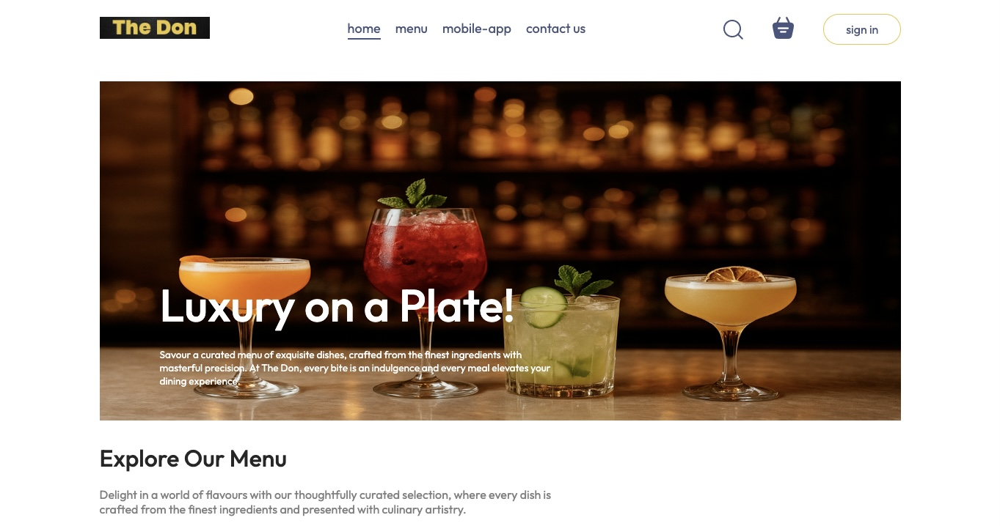
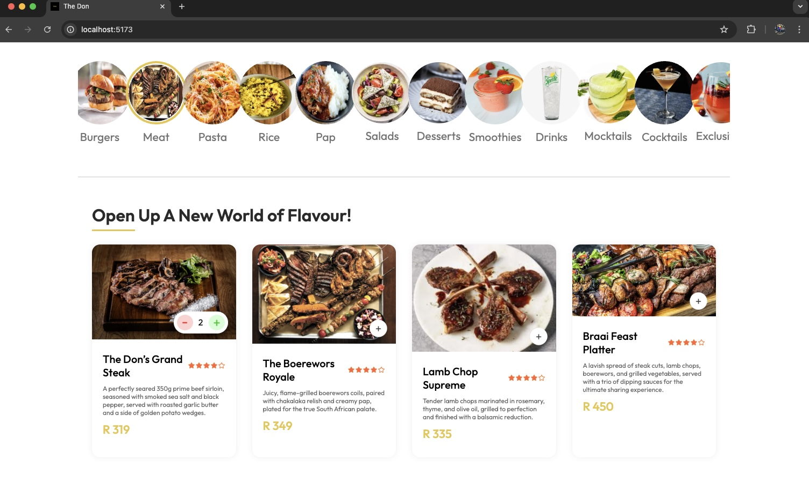
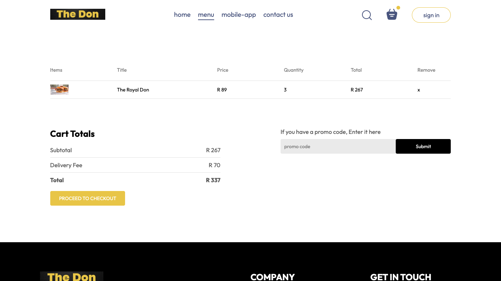

# 🍴 Food Delivery E-Commerce App

A food delivery e-commerce application built with **React 18** and **Vite**, focused on delivering a complete and reliable order flow — from browsing menu items to checkout, payment simulation and order confirmation.

This project emphasizes **state consistency**, **edge-case handling** and **clean user experience** across the full purchase lifecycle, closely reflecting how real production frontends are structured.

---

## 🚀 Live Demo

*https://react-delivery.netlify.app/*

---

## ✨ Key Features

* End-to-end ordering flow: **Menu → Cart → Checkout → Payment → Order Success**
* Dynamic shopping cart with real-time updates
* Centralized pricing logic to ensure consistency across pages
* Cart persistence using `localStorage` to handle page refreshes
* Guards to prevent invalid states (e.g. empty cart checkout)
* Order summary persistence with automatic cleanup after confirmation
* Auto-redirect on successful order with countdown feedback
* Fully responsive UI optimized for mobile and desktop

---

## 🧠 Engineering Highlights

* **State Management:** React Context API used for predictable and scalable state sharing across the app
* **Persistence Strategy:** Cart and order data stored in `localStorage` to simulate real user sessions without backend complexity
* **Business Logic Separation:** Pricing, delivery fee and totals calculated via centralized helper functions
* **UX Safeguards:** Disabled actions and redirects to prevent broken flows (e.g. checkout with empty cart)
* **Production-Oriented Thinking:** Designed with backend and payment gateway integration in mind

---

## 🛠️ Tech Stack

**Frontend**

* React 18
* Vite

**Styling**

* CSS (custom, no UI frameworks)

**State Management**

* React Hooks
* Context API

**Assets**

* Custom icons, logo and curated images

---

## 📸 Screenshots

### Homepage



### Product Page



### Checkout



---

## ⚙️ Installation & Setup

Clone the repository:

```bash
git clone https://github.com/njabulophiri-dev/react-food-delivery.git
cd react-food-delivery
```

Install dependencies:

```bash
npm install
```

Run the development server:

```bash
npm run dev
```

The app will be available at:

```text
http://localhost:5173
```

---

## 🧩 Design Decisions

* **Context API over Redux:** Chosen to avoid unnecessary complexity while maintaining clear data flow
* **No Backend (Yet):** Focused on frontend reliability, UX and state management before API integration
* **Simulated Payment Flow:** Allows validation of checkout logic and order lifecycle without third-party dependencies
* **Incremental Enhancement:** Features added iteratively with refactoring to improve stability

---

## 🔮 Future Improvements

* Backend API integration (Node.js / Spring Boot)
* Real payment gateway integration
* Authentication and user accounts
* Order history and admin dashboard
* Improved error handling and loading states

---

## 👤 Author

**Njabulo Phiri**
BSc Honours in Computer Science & IT
Aspiring Full-Stack Software Engineer

---

## 🤝 Feedback & Collaboration

Feedback, suggestions and code reviews are welcome. If you’re a software engineer or recruiter, feel free to connect — always happy to discuss improvements and next steps.
